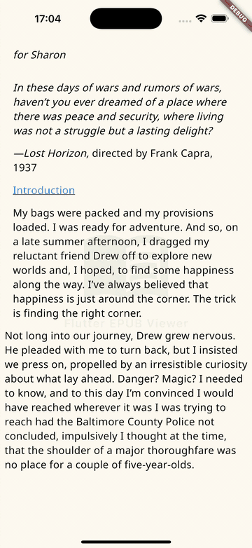

# open_epub

A customizable EPUB reader widget for Flutter. Supports iOS, Android, and Web platforms with features like pagination, bookmarks, and customizable themes.



## Features

- EPUB file loading from assets, files, URLs, or bytes
- Page mode and scroll mode
- Customizable themes (background color, text color)
- Font family and size settings
- Line spacing and margin controls
- Bookmark management
- Resume reading from last position
- Custom top/bottom bar support
- Optional watermark overlay via custom widget
- **Automatic settings persistence** - Reader settings are automatically saved to device storage
- Max readable pages limit (for preview/trial mode)
- **Multi-language localization** - Built-in support for 11 languages
- **Dynamic EPUB source swap** - Change the book without recreating the widget

```bash
flutter pub add open_epub
```

## Basic Usage

```dart
import 'package:open_epub/open_epub.dart';

class ReaderPage extends StatefulWidget {
  @override
  State<ReaderPage> createState() => _ReaderPageState();
}

class _ReaderPageState extends State<ReaderPage> {
  late final EpubReaderController _controller;

  @override
  void initState() {
    super.initState();
    _controller = EpubReaderController();
  }

  @override
  void dispose() {
    _controller.dispose();
    super.dispose();
  }

  @override
  Widget build(BuildContext context) {
    return EpubReaderWidget(
      source: const EpubSourceAsset('assets/book.epub'),
      controller: _controller,
      // Settings (theme, font, etc.) are automatically saved to device
      // Use a unique key per book if needed
      settingsStorageKey: 'epub_reader_settings',
      watermark: Opacity(
        opacity: 0.08,
        child: Image.asset('assets/watermark.png', width: 200),
      ),
    );
  }
}
```

## EPUB Sources

```dart
// From assets
EpubSourceAsset('assets/book.epub')

// From file path
EpubSourceFile('/path/to/book.epub')

// From URL
EpubSourceUrl('https://example.com/book.epub')

// From bytes
EpubSourceBytes(Uint8List bytes)
```

## Switching Books

You can swap the EPUB source dynamically without recreating the widget:

```dart
// The widget detects source changes and reloads automatically
EpubReaderWidget(
  source: _currentSource,  // Change this to load a different book
  controller: _controller,
);

// Example: switch book on button tap
void _switchBook() {
  setState(() {
    _currentSource = const EpubSourceAsset('assets/other_book.epub');
  });
}
```

## Controller

The `EpubReaderController` provides programmatic control and callbacks:

```dart
final controller = EpubReaderController(
  // Resume reading position (0.0 ~ 1.0)
  initialProgress: 0.5,

  // Initial bookmarks (load from your database)
  initialBookmarks: savedBookmarks,

  // Callbacks
  onPositionChanged: (position) {
    // Save position.progress to your database
  },
  onSettingsChanged: (settings) {
    // Settings are auto-saved, but you can also react to changes
  },
  onBookmarkAdded: (bookmark) {
    // Save bookmark to your database
  },
  onBookmarkRemoved: (bookmark) {
    // Remove bookmark from your database
  },
);
```

### Controller Methods

```dart
// Navigation
controller.nextPage();
controller.previousPage();
controller.goToPage(10);
controller.goToProgress(0.5);

// Bookmarks
controller.addBookmark();
controller.removeBookmark(bookmark);
controller.toggleBookmark();
controller.goToBookmark(bookmark);

// Settings
controller.showSettings();  // Shows built-in settings modal
controller.updateSettings(newSettings);

// Properties
controller.currentPage;      // Current page index (0-based)
controller.totalPages;       // Total number of pages
controller.progress;         // Reading progress (0.0 ~ 1.0)
controller.bookmarks;        // List of bookmarks
controller.currentSettings;  // Current ReaderSettings
controller.isCurrentPageBookmarked;
```

## Localization

All UI strings default to Korean for backwards compatibility. Use built-in presets or provide custom translations:

```dart
// English
EpubReaderWidget(
  source: source,
  localization: EpubReaderLocalization.english,
);

// Japanese
EpubReaderWidget(
  source: source,
  localization: EpubReaderLocalization.japanese,
);

// Custom language
EpubReaderWidget(
  source: source,
  localization: EpubReaderLocalization(
    theme: 'Tema',
    font: 'Fuente',
    fontSize: 'Tamaño',
    // ... all fields have Korean defaults, so you only need to override what you want
  ),
);
```

### Built-in Languages

| Language | Constant | Speakers |
| --- | --- | --- |
| Korean | `korean` (default) | 80M |
| English | `english` | 1.5B |
| Chinese (Simplified) | `chinese` | 1.1B |
| Hindi | `hindi` | 600M |
| Spanish | `spanish` | 550M |
| Arabic | `arabic` | 400M |
| French | `french` | 300M |
| Portuguese | `portuguese` | 260M |
| Russian | `russian` | 250M |
| Japanese | `japanese` | 125M |
| German | `german` | 100M |

### Localized Strings

All localizations cover the following UI elements:

| Category | Fields |
| --- | --- |
| Settings labels | `theme`, `font`, `fontSize`, `lineSpacing`, `margin`, `viewMode` |
| Mode labels | `pageMode`, `scrollMode`, `resetSettings` |
| Font names | `fontNotoSans`, `fontSerif`, `fontSansSerif` |
| Error messages | `loadFailed`, `unknownError`, `cannotLoadContent`, `checkFileFormat` |
| Misc | `themeSampleChar` (character shown in theme color swatches) |

Color theme names (`ColorTheme.name`) use English globally and are not part of localization.

## Custom Top/Bottom Bars

The `topBarBuilder` must return a `PreferredSizeWidget`:

```dart
EpubReaderWidget(
  source: const EpubSourceAsset('assets/book.epub'),
  controller: _controller,
  showTopBar: true,
  showBottomBar: true,
  topBarBuilder: (context, settings) {
    // Must return PreferredSizeWidget (AppBar, PreferredSize, etc.)
    return AppBar(
      backgroundColor: settings.backgroundColor,
      title: Text('My Reader', style: TextStyle(color: settings.textColor)),
      actions: [
        IconButton(
          icon: Icon(
            _controller.isCurrentPageBookmarked
                ? Icons.bookmark
                : Icons.bookmark_border,
          ),
          onPressed: () => _controller.toggleBookmark(),
        ),
        IconButton(
          icon: const Icon(Icons.settings),
          onPressed: () => _controller.showSettings(),
        ),
      ],
    );
  },
  bottomBarBuilder: (context, settings) {
    return Container(
      color: settings.backgroundColor,
      padding: const EdgeInsets.all(16),
      child: Row(
        mainAxisAlignment: MainAxisAlignment.spaceBetween,
        children: [
          Text(
            '${_controller.currentPage + 1} / ${_controller.totalPages}',
            style: TextStyle(color: settings.textColor),
          ),
          Row(
            children: [
              IconButton(
                icon: Icon(Icons.chevron_left, color: settings.textColor),
                onPressed: () => _controller.previousPage(),
              ),
              IconButton(
                icon: Icon(Icons.chevron_right, color: settings.textColor),
                onPressed: () => _controller.nextPage(),
              ),
            ],
          ),
        ],
      ),
    );
  },
);
```

## ReaderSettings

```dart
const ReaderSettings({
  Color backgroundColor,    // Default: Color(0xFFFFFBF0)
  Color textColor,          // Default: Colors.black
  String fontFamily,        // Default: 'Noto Sans'
  int fontSize,             // 1~9, Default: 4
  int lineSpacing,          // 1~5, Default: 2
  int margin,               // 1~5, Default: 1
  bool isPageMode,          // Default: true
});

// Computed values
settings.actualFontSize;        // 12~28px
settings.actualLineHeight;      // 1.2~2.0
settings.actualMargin;          // EdgeInsets (8~40px)
settings.actualParagraphSpacing;

// JSON serialization
final json = settings.toJson();
final restored = ReaderSettings.fromJson(json);
```

## Settings Persistence

Reader settings (theme, font size, line spacing, etc.) are **automatically saved** to device storage using SharedPreferences.

```dart
EpubReaderWidget(
  source: const EpubSourceAsset('assets/book.epub'),
  controller: _controller,
  // Default key: 'epub_reader_settings'
  // Use a unique key per book if you want separate settings
  settingsStorageKey: 'my_book_settings',
  // Set to null to disable auto-save
  // settingsStorageKey: null,
);
```

Settings are automatically:

- Loaded when the widget initializes
- Saved whenever settings change (theme, font, margin, etc.)
- Restored on app restart

### Manual Persistence (Position & Bookmarks)

Reading position and bookmarks are **not** auto-saved. Use callbacks to save them to your own storage:

```dart
final controller = EpubReaderController(
  initialProgress: savedProgress,  // Load from your database
  initialBookmarks: savedBookmarks,  // Load from your database
  onPositionChanged: (position) {
    // Save to your database
    database.saveProgress(bookId, position.progress);
  },
  onBookmarkAdded: (bookmark) {
    database.saveBookmark(bookId, bookmark.toJson());
  },
  onBookmarkRemoved: (bookmark) {
    database.deleteBookmark(bookId, bookmark.pageIndex);
  },
);
```

## Max Readable Pages (Preview Mode)

Limit how many pages users can read (useful for trial/preview mode):

```dart
EpubReaderWidget(
  source: const EpubSourceAsset('assets/book.epub'),
  controller: _controller,
  maxReadablePages: 10,  // Only first 10 pages are accessible
  onMaxPageReached: (maxPage, totalPages) {
    // Called when user tries to go beyond the limit
    showDialog(
      context: context,
      builder: (context) => AlertDialog(
        title: Text('Preview Limit'),
        content: Text('Purchase to read all $totalPages pages.'),
      ),
    );
  },
);
```

## Callbacks

```dart
EpubReaderWidget(
  source: source,
  controller: controller,
  onPageChanged: (current, total) {
    print('Page: $current / $total');
  },
  onBookLoaded: (title, author) {
    print('Loaded: $title by $author');
  },
  onError: (error) {
    print('Error: $error');
  },
  onMaxPageReached: (maxPage, totalPages) {
    print('Reached limit: $maxPage / $totalPages');
  },
);
```

## Available Font Families

- `'Noto Sans'` (default)
- `'Nanum Myeongjo'`
- `'Nanum Gothic'`

## Color Themes

Built-in themes available via `colorThemes`:

| Name | Background | Text |
| --- | --- | --- |
| Warm | #FFFBF0 | Black |
| Gray | #E8E8E8 | Black87 |
| Black | #000000 | White |
| Dark | #1E1E1E | #E0E0E0 |
| Green | #E8F5E9 | #1B5E20 |
| Blue Gray | #ECEFF1 | #263238 |

## Security & Scripting Policy

open_epub renders book content **without a JavaScript runtime**. EPUB3 Scripted
Content (`<script>`, inline event handlers, `javascript:` URLs, embedded
`<iframe>`/WebView) is **intentionally not supported** — this is a security
decision, not a missing feature, and there is no plan to enable it.

**Why**

- Executing book-supplied scripts would expose the reader to arbitrary code
  execution, data exfiltration, and resource abuse. Book content is not trusted
  with that capability.
- The reflowable/fixed-layout renderer is `flutter_widget_from_html_core`, which
  has no JS engine, no DOM, and no WebView. The all-in-one
  `flutter_widget_from_html` is deliberately **not** used because it pulls in
  `fwfh_webview` (`<iframe>` → WebView), video, and audio.
- EPUB3 permits reading systems to disable scripting (it is an optional
  feature). Content marked `epub:scripted` should ship a static fallback.

**Defense in depth**

1. **Engine sanitize** — before rendering, `html_sanitizer` strips `<script>`
   and `<iframe>` elements (paired and self-closing). Controlled by
   `EpubSecurityConfig.blockExternalScripts` / `blockIframes` (both `true` by
   default).
2. **Renderer never executes** — `flutter_widget_from_html_core` does not render
   `<script>`/`<style>` and ignores inline event-handler attributes such as
   `onclick`; `javascript:` links are not routed (gated by `onTapUrl`).

**Scope**

- Applies to both reflowable body and fixed-layout XHTML pages (same render
  path).
- Static content is unaffected: script-free SVG, images, and math
  (MathML → TeX) render normally. Only executable code is blocked.

This policy is locked by widget regression tests (script/iframe not rendered,
inline handlers ignored). Other hardening — zip-slip path normalization,
cross-origin image handling, and a file-size limit — is configured through
`EpubSecurityConfig`.

## License

MIT
